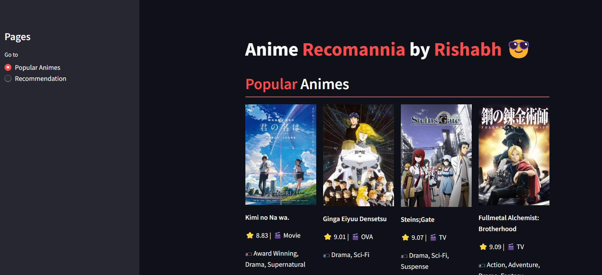
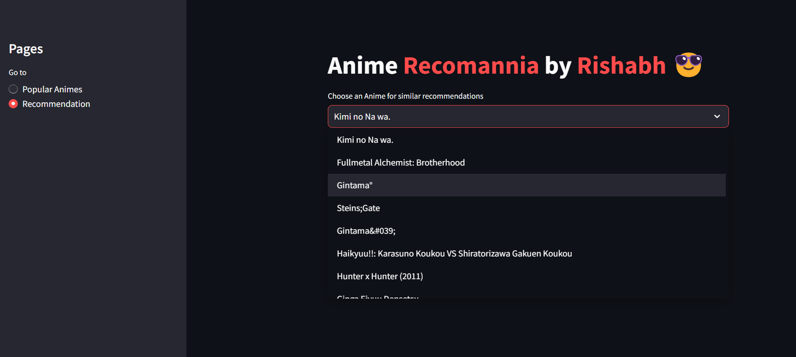
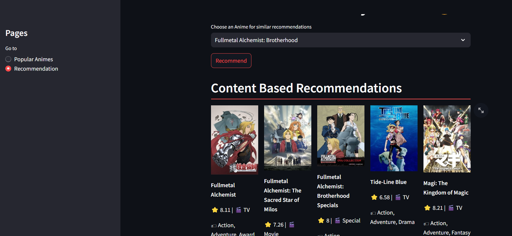

# Anime-recommendation-system
Content Based Anime Recommendation Streamlit App

i.) It uses the 'Anime Recommendations Database' from Kaggle(link-'https://www.kaggle.com/datasets/CooperUnion/anime-recommendations-database?select=anime.csv') to analyze and display the top 50 Popular animes based on the rating and number of votes received by the animes.

## This is the 'Popular Animes' page of the app-




ii.) It also uses the TF-IDF vectorization technique to display 5 similar content based anime recommendations on choosing one anime from the list on the recommendation page.

## This is the 'Recommendation' page of the app-




iii.) To fetch the anime info 'myanimelist.net' api is used.

## To get started with this project,follow the steps mentioned below:
1. Clone the repository
```bash
git clone https://github.com/rishabhpancholi/anime-recommendation-system.git
cd anime-recommendation-system
```

2. Download the required file 'similarity.pkl'
Run the following script to download it from google drive-

```bash
python download.py
```
or you can download 'similarity.pkl' through this google drive link 'https://drive.google.com/file/d/17HNfZYjQenEpfidGU-PvS4Xj4_JLLrrJ/view?usp=sharing'

3.Install dependencies
Install the following python packages using the following script-

```bash
pip install -r requirements.txt
```

4.Run the application through this command-

```bash
python app.py
```


link to the app-'https://anime-recomannia.streamlit.app/'
